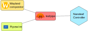

+++
title = "Leafpipe"
description = "Turning lots and lots of audio/visual into pretty stimuli"
date = 2023-12-04
[taxonomies]
categories = ["hacking", "rust", "audio", "video", "rgb", "leafpipe"]
[extra]
project_url="https://github.com/Half-Shot/leafpipe"
image="/blog/leafpipe/nanoleaf.webp"
image_alt="A picture of some hexagonal Nanoleaf Shape lights against a wall."
+++

A few years ago after moving into a flat, I was staring at a white wall (I presume this isn't unique to the UK, walls are always boring and white).
A friend of mine suggested that the wall really could do with some RGB lights, and being the sort of person who is naturally attracted to flashy
rainbows...I went and purchased some [Nanoleaf](https://nanoleaf.me) lights.

Nanoleaf make "Shapes" panels which are neat little diffuse LED hexagons, that can be connected like LEGO to each other. You can stick them to walls
and make the prettiest of displays.

{{ figure(
    src="/blog/leafpipe/nanoleaf.webp",
    href="/blog/leafpipe/nanoleaf.webp",
    caption="Marketing impression of how you are meant to arrange your lights. Totally not my wall! Image: © Nanoleaf",
    alt="A picture of some hexagonal Nanoleaf Shape lights against a wall.")
}}


*However*. There is one feature that **sucks**: the audio-driven panel effects.

Although you can arrange the panels nicely and apply some pretty effects to music, they process audio
though a built-in microphone (so the quality is a bit crap). There is no video feed for them, so they cannot adapt to any inputs
to produce a pleasing hue to the music either. You end up with panels that sort of adjust to your music, providing you are playing loudly enough.
However, since this is all happening on the controller the performance isn't *great*.

Otherwise, the kit is pretty solid. They connect to the Wi-Fi and can be controlled via a standard REST API.
It would be better if the [API docs](https://forum.nanoleaf.me/docs) were accessible without a forum account though,
despite industry trends it just seems redundant.

It should be noted that some models allow you to clip in a 3.5" jack for better quality audio, but:

  1. This is only for the more expensive models.
  2. You still have to process the effects on the lower-powered controller.
  3. Still no ability to capture video.

## Leafpipe

I built leafpipe to basically take input from my PC and send it onto the lights to make the aforementioned pretty displays. It uses a combination
of Pipewire, and the Wayland screencopy protocol. It's a little Rust daemon that sits there relentlessly capturing data and spewing out packets
to the Nanoleaf controller. 

<figure>
  
  <figcaption>Rough outline of how this all fits together</figcaption>
</figure>


I'll explain roughly how the process works.

### Video processing

For the visual side, we take a copy of a chosen display every `33ms`. The frame is copied into a buffer, and then split into chunks of 4 bytes
to make up a set of pixels (RGBA). 

We then further split things so we only read every 8th pixel (to save on processing time) to achieve a sort
of rough approximation of what's on screen.

Finally, we split each of the pixels horizontally by the number of panels we have. So if we
have 8 Nanoleaf panels, we split the frame by 8. These pixels are converted to HSL so we can evaluate the lightness aspect of them, which will come
in handy in just a second.

```rust
// From https://github.com/Half-Shot/leafpipe/blob/c4537c564def652b57bf9daa54f4538d7e61bd29/src/visual/prominent_color.rs#L27
/**
 * How many pixels to skip in a chunk, for performance.
 */
const SKIP_PIXEL: usize = 8;
pub fn determine_prominent_color(frame_copy: FrameCopy, heatmap: &mut [Vec<Vec<Vec<u32>>>]) -> Vec<Hsl> {
    if ColorType::Rgba8 != frame_copy.frame_color_type {
        panic!("Cannot handle frame!")
    };
    let split_by = heatmap.len();
    let mut most_prominent = vec![Hsl::from(0.0, 0.0, 0.0); split_by];
    let mut most_prominent_idx: Vec<u32> = vec![0; split_by];
    let split_width: u32 = frame_copy.width / split_by as u32;
    let chunk_size = 4 + (SKIP_PIXEL*4);
    
    for (chunk_idx, chunk) in frame_copy.data.chunks_exact(chunk_size).enumerate() {
        let x = ((chunk_idx * chunk_size) / 4) % frame_copy.width as usize;
        let panel_idx = (x as f32 / split_width as f32).floor().min(split_by as f32 - 1.0f32) as usize;

        let hsl = Rgb::from(chunk[0] as f32, chunk[1] as f32, chunk[2] as f32).to_hsl();
```

We then take these samples, and apply some simple evaluations to each pixel to skip anything that might be "dull" (really light or really dark
colours tend to be a bit boring on a RGB display).

Within each panel, we take a heatmap of the pixels and choose whichever pixel ranks highest. The heatmap is effectively a 4 dimensional array of
all the panels x [possible hue values] x [possible saturation values] x [possible lightness values].

```rust
        // Reject any really dark colours.
        if LIGHTNESS_MAX < hsl.get_lightness() || hsl.get_lightness() < LIGHTNESS_MIN {
            continue;
        }
        if hsl.get_saturation() < SATURATION_MIN {
            continue;
        }
        // Split into 36 blocks
        let h_index = (hsl.get_hue() as usize) / 10; // 0-255
        let s_index = (hsl.get_saturation() as usize) / 5; // 0-100
        let l_index = (hsl.get_lightness() as usize) / 5; // 0-100
        let new_prominence = heatmap[panel_idx][h_index][s_index][l_index] + 1;
        // With what's left, primary focus on getting the most prominent colour in the frame.
        heatmap[panel_idx][h_index][s_index][l_index] = new_prominence;
        if new_prominence > most_prominent_idx[panel_idx] {
            most_prominent[panel_idx] = Hsl::from(
                (h_index * 10) as f32,
                (s_index * 5) as f32,
                (l_index * 5) as f32,
            );
            most_prominent_idx[panel_idx] = new_prominence;
        }
    }
    most_prominent
}
```

Again for resource reasons, we approximate the values of these and round up into blocks. For instance, a pixel of H: 15, S: 20, and L: 50
would be put in heatmap block `[1][4][10]`. Once all the pixels have been evaluated, we can return a set of most prominent values.

### Audio processing

While that's ongoing, we also process the audio through Pipewire. I can't pretend to say I did any of the work on processing it.
[BlankParenthesis](https://github.com/BlankParenthesis) wrote a beautiful visualisation program for audio which I repurposed to be used in this.
I can't begin to explain how it all works, but the end result is that for a given frame of audio data we get a amplitude value for each frequency.

We take this computed value of amplitude and put it in a sliding window. The idea here is that we want to get an idea of "relative" power
across an given length of audio (in this case, 64 frames). If we're playing some really quiet music we don't want the lights to be
virtually off. The sliding window stores every value computed, and gives us the min/max of the last 64 values. The min/max give us an idea
of how much we should then tweak the lightness for the latest frame.

```rust
// https://github.com/Half-Shot/leafpipe/blob/9d5f3d1ec0eaea00c700c224c2e284a4fc491f13/src/main.rs#L56
    let mut window = SlidingWindow::new(64);
    let color = hsl_color_from_video_processing;
    // This would loop
    if let Some(audio_data) = buffer_manager.write().unwrap().fft_interval(LIGHT_INTERVAL, panels.num_panels) {
        for (panel_index, _panel) in sorted_panels.iter().enumerate() {
            // Submit our value, and return min,max.
            let (min, max) = window.submit_new(audio_data[panel_index]);
            let base_int = color.get_lightness() - 10.0;
            let intensity = (base_int + ((audio_data[panel_index] + min) / max) * intensity_modifier * (panel_index as f32 + 1.0f32).powf(1.05f32)).clamp(5.0, 80.0);
            let hsl = Hsl::from(color.get_hue(), color.get_saturation(), intensity);
            let rgb = hsl.to_rgb().as_tuple();
            let r = rgb.0.round() as u8;
            let g = rgb.1.round() as u8;
            let b = rgb.2.round() as u8;
            // And write this result to the nanoleaf
        }
    }
```

The intensity algorithm ends up looking like:

`intensity = clamp((base_colour_intensity + relative_recent_intensity) * intensity_modifier * panel_index^1.05, 5, 80)`. 

We allow the user to specify a modifier value (defaulting to `15`) in case they would like to turn up or tone down the effect. We also clamp the value
to prevent blinding users or turning the lights off completely.

Once we have our final RGB value, that's it!

**Oh wait, no!**

How do we get that data to the panel?

### Sending the data

So the Nanoleafs have a feature where you can enable `extControl` mode where the controller sort of turns off its brain and just interprets
raw data for each of the panels.

```sh
curl -X PUT --data '{"write":{"command": "display", "animType": "extControl", "extControlVersion": "v2"}}' 'http://{hostname}:16021/api/v1/}{token}/effects
```

It's really cool! It uses UDP, so you can effectively fire off new frames as fast as you like to control each panel. (Although in my testing anything
higher than 100ms would cause it to melt). We therefore send a new payload of data to the controller every `100ms` which contains the
values calculated. You need to give the effect a "transition time" because it likes to do a fade-effect between colours, so we set that to
`100ms`.

<figure>
  <video alt="Demo video of the final product" src="demo.webm" controls poster="demo.webp"> </video>
  <figcaption>Video taken from <a href="https://www.youtube.com/watch?v=eoY1Mc70uTo">Blender 4.0 - Reel</a></figcaption>
</figure>

### Final thoughts

This project was only made possible by the hard work of the Wayshot project for showing me how to capture a frame from a Wayland compositor, and
BlankParenthesis for developing visualisation software for Pipewire streams.

I'm sure you have noticed by now dear reader, that this could work for any set of network addressable lights rather than just a particular brands
particular product. Yes. Definitely. But I think I'll leave that as a future idea for someone with other lights to pick up 😉.

You can check out the code on [GitHub](https://github.com/Half-Shot/leafpipe) and it should compile and run for anyone with a Nanoleaf Shapes
device (and of course, you must run a Linux setup with Wayland and Proton).

## References

- [Leafpipe](https://github.com/Half-Shot/leafpipe)
- [pxlha](https://github.com/Half-Shot/pxlha) 
- [BlankParenthesis/visualiser](https://github.com/BlankParenthesis/visualiser)
- [wayshot](https://github.com/waycrate/wayshot)
